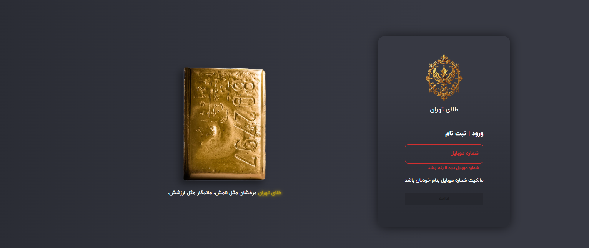
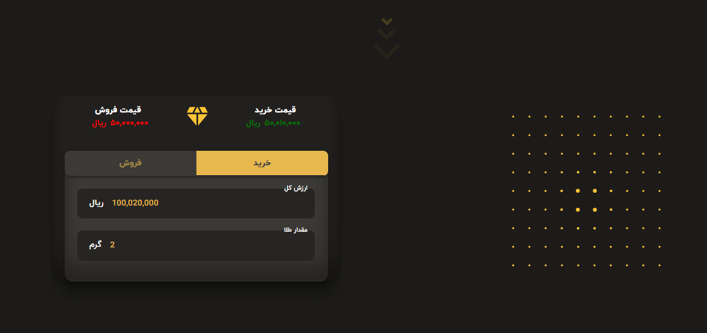
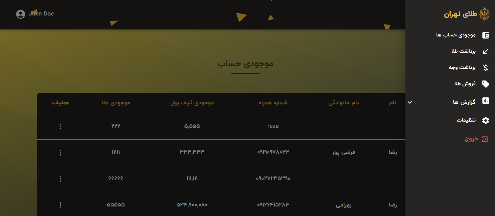
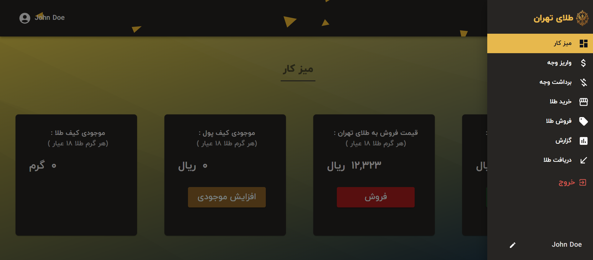

<div align="center">


<div>
   
    
    
     
    
    
    
  
</div>

  <h3 align="center">Gold Store</h3>

</div>

## 📋 <a name="table">Table of Contents</a>

1. 🤖 [Introduction](#introduction)
2. ⚙️ [Tech Stack](#tech-stack)
3. 🔋 [Features](#features)
4. 📂 [Project structure](#project-structure)
5. 🕸️ [Code to Copy](#snippets)
6. 🔗 [Assets](#links)

## <a >🖼️ Admin and Auth</a>

<div align="center">
  <table>
    <tr>
   <td></td>
   <td></td>
    </tr>
    <tr>
      <td></td>
     <td></td>
    </tr>
  </table>
</div>


## <a name="introduction">🤖 Introduction</a>

Developed with React and Vite for a fast and responsive user interface, TypeScript for type-safe development, and a Python/Django backend for robust server-side logic, this web application powers a platform for trading melted gold. It features two dedicated dashboards: one for admins to manage and approve transactions, and another for clients to purchase melted gold seamlessly. The platform streamlines the trading process with a secure, interactive, and user-friendly experience.

## <a name="tech-stack">⚙️ Tech Stack</a>

- React
- Vite
- Mui
- axios
- React Hook Form
- zod
- zustand
- Python
- Django
- Postgresql

## <a name="features">🔋 Features</a>

👉 **Secure OTP Authentication** Seamless login and sign-up for both admins and clients using phone numbers with OTP verification for enhanced security.

👉 **Dual Dashboards** Admin Dashboard: Manage and approve/reject gold trading transactions, monitor activity logs, and generate detailed reports.

Client Dashboard: User-friendly interface for clients to purchase melted gold, view transaction history, and access personalized reports.

👉 **Comprehensive Reporting** Both admins and clients can access detailed reports for transaction history and platform usage.

👉 **Responsive Design** Fully optimized for mobile, tablet, and desktop devices, ensuring a consistent and seamless experience.

**Prerequisites**
Make sure you have the following installed on your machine:

- [Git](https://git-scm.com/)
- [Node.js](https://nodejs.org/en)
- [npm](https://www.npmjs.com/) (Node Package Manager)

**Cloning the Repository**

```bash
git clone https://github.com/RezaFarzipour/Metallugical_Research_Center
cd portfolio
```

**Installation**

Install the project dependencies using npm:

```bash
npm install
```

**Running the Project**

```bash
npm run dev
```

Open [http://localhost:5173](http://localhost:5173) in your browser to view the project.

## <a name="project-structure">📂 Project Structure</a>

```ts
src
├── assets
│   ├── fonts
│   │   └── IRANYekanWeb*.woff2
│   ├── images
│   │   ├── gold-block.webp
│   │   ├── logo.png
│   │   └── *.jpg
│   ├── video
│   │   └── header.mp4
│   └── Animation.json
├── components
│   ├── containers
│   │   ├── layout
│   │   │   ├── authLayout.tsx
│   │   │   ├── Footer.tsx
│   │   │   ├── Layout.tsx
│   │   │   └── navbar.tsx
│   │   ├── DashboardLayout.tsx
│   ├── element
│   │   ├── auth
│   │   │   ├── verifyNumberButton.tsx
│   │   │   └── verifyNumberInput.tsx
│   │   ├── buyandsell
│   │   │   ├── BoxFooter.tsx
│   │   │   └── FormControl.tsx
│   │   ├── navbar
│   │   │   ├── DrawerElement.tsx
│   │   │   └── NavLink.tsx
│   │   ├── ActionMenu.tsx
│   │   ├── CircularLoading.tsx
│   │   └── ProtectedRoute.tsx
│   ├── modules
│   │   ├── authModules
│   │   │   ├── VerifyCodeBoxInput.tsx
│   │   │   └── VerifyNumberBoxInput.tsx
│   │   ├── customerDashboard
│   │   │   ├── BuyAndSellBoxModule.tsx
│   │   │   └── HomeBoxesModule.tsx
│   │   ├── home
│   │   │   ├── anim
│   │   │   │   ├── AnimateModule.tsx
│   │   │   │   └── ArrowBottom.tsx
│   │   │   ├── steper
│   │   │   │   └── SteperModule.tsx
│   │   │   ├── tabPrice
│   │   │   │   └── TabPrice.tsx
│   │   ├── DashboardAppbarModule.tsx
│   │   └── ReusableTable.tsx
│   ├── template
│   │   ├── adminDashboard
│   │   │   ├── reports
│   │   │   │   ├── ReportsTemp.tsx
│   │   │   │   └── TransactionsTemp.tsx
│   │   │   ├── withdraw
│   │   │   │   ├── CashWithdrawTemp.tsx
│   │   │   │   └── GoldWithdrawTemp.tsx
│   │   ├── customerdashboard
│   │   │   ├── BuyGoldTemp.tsx
│   │   │   └── DashboardHomeTemp.tsx
│   │   ├── homepage
│   │   │   └── HomeTemp.tsx
│   │   ├── verifycode
│   │   │   └── VerifyCodeTemp.tsx
│   │   ├── verifynumber
│   │   │   └── VerifyNumberTemp.tsx
├── configs
│   ├── api.ts
│   └── reactQuery.ts
├── constants
│   └── data.tsx
├── context
│   └── ToastProvider.tsx
├── hooks
│   ├── useAuthorize.ts
│   └── useGoldConverter.ts
├── pages
│   ├── 404.tsx
│   ├── AdminDashboard.tsx
│   ├── CustomerDashboard.tsx
│   ├── Home.tsx
│   ├── VerifyCode.tsx
│   └── VerifyNumber.tsx
├── routes
│   ├── AdminDashboardRoutes.tsx
│   ├── AppRoutes.tsx
│   └── CustomerDashboardRoutes.tsx
├── schemas
│   ├── editProfileSchema.ts
│   └── phoneSchema.ts
├── services
│   ├── adminPanel.ts
│   ├── auth.ts
│   └── customerDashboard.ts
├── styles
│   ├── globals.css
│   └── theme.ts
├── types
│   └── index.ts
├── utils
│   ├── cookie.ts
│   └── numberFormatter.ts
├── App.tsx
├── main.tsx
└── vite-env.d.ts
```

## <a name="links">🔗 Assets</a>

Assets used in the project can be found [here](https://Emdaportfolio.com)
